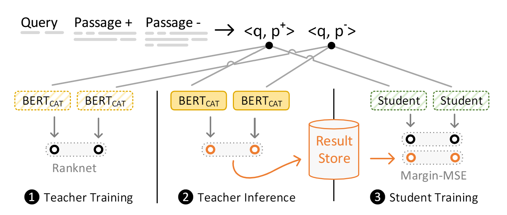
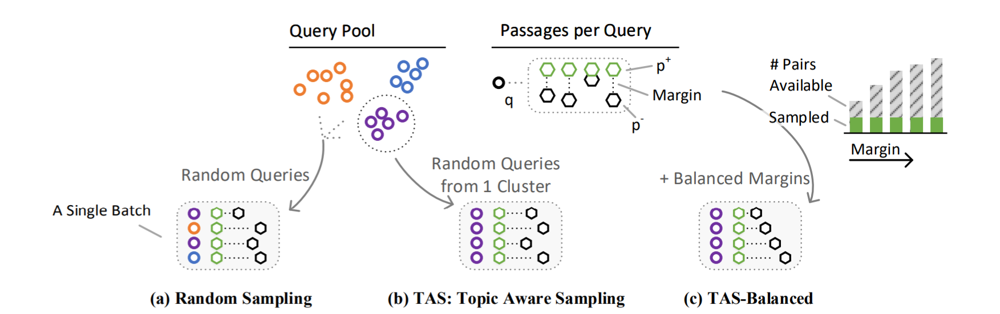
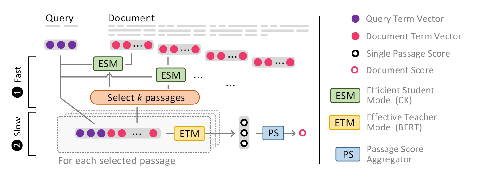

# Welcome to Matchmaker 👋

Matchmaker is a research library for rapid training, evaluation, and analysis of text-based neural re-ranking and retrieval models built with PyTorch. Initially created to support Transformer-Kernel research, now evolved to a general library, with broad support for knowledge distillation. 

## Features

* 🔎 **Train a diverse set of neural IR models** including re-ranking & dense retrieval models based on HuggingFace transformers, TK-style models, and non-Bert neural baselines. 
  * Wide range of configurations available
  * Static & dynamic sampling of batches (including TAS-Balanced)
  * Support for mixed precision (fp16) & multi-GPU training
* 🧙‍♂️ **Knowledge distillation** with support for static + dynamic teachers; cross-architecture students; pairwise, in-batch negatives, dual-supervision
  * Including our Margin-MSE and many other loss options
* 📄 **Evaluate models** with common IR metrics for multiple query sets for re-ranking and retrieval workflows
  * Efficiency metric tracking built in to everything
  * Including re-ranking depth evaluation
  * Highly optimized dense retrieval encoding, indexing, & search pipeline
* 📚 **Experiment management** with folder based experiments, config & code tracking and the possibility to stack experiments one after another
  * Tensorboard files with dozen+ IR-specific telemetry statistics per experiment
  * Export models to the HuggingFace model hub

If you have little experience with neural IR, we recommend you take a look at our (completely open & free) master level university course on *Advanced Information Retrieval* (Summer of 2021) at: https://github.com/sebastian-hofstaetter/teaching 🧙‍♂️

*Disclaimer: This library is created for research purposes, so it might break at any point. If you have problems, feel free to create an issue. If you are looking for a better tested, production ready search system - please have a look at [Pyserini](https://github.com/castorini/pyserini) or Vespa.ai*

## Getting started

### Requirements

We recommend using a fresh conda environment with Python 3.8 *(can't use 3.9 atm, because of faiss)* 

```
conda create -n matchmaker python=3.8
conda activate matchmaker
```

Then cd to the root folder of this repo, activate the conda environment, and install faiss & pytorch via conda. *We have to install faiss separately, because it does not have official pypi packages* 

```
conda install --file conda-requirements.txt -c conda-forge -c pytorch
```

Then install the rest of the dependencies (allennlp, huggingface, ...) via pip install of the pip-requirements.txt

```
pip install -r pip-requirements.txt
```

**[Optional]** If you want to use the onnx runtime (currently implemented for dense_retrieval.py) you need to manually install cuDNN 8.0 (as of June 2021) which is a bit of a pain, but worth it :)

Go to the NVIDIA website to download cuDNN 8.0 for your system (https://developer.nvidia.com/rdp/cudnn-archive), extract it and copy into the conda path (thanks to: https://stackoverflow.com/a/65335472): 

```
cp cuda/include/cudnn*.h <conda environment path>/include
cp cuda/lib64/libcudnn* <conda environment path>/lib
```

> For more info on onnx see: https://github.com/microsoft/onnxruntime/tree/master/onnxruntime/python/tools/transformers & https://medium.com/microsoftazure/accelerate-your-nlp-pipelines-using-hugging-face-transformers-and-onnx-runtime-2443578f4333

**Now you should be good to go!** Next up is matchmaker's data input format & depending on your interests we have some getting started guides below.

### Input Data Format

In general every data input file in matchmaker is a .tsv file with tabs separating columns, as found in MSMARCO v1. We choose this format, because it allows us to easily open and operate on files, and changing tabs in the text does not alter the meaning of it. If you have a collection in another format such as older TREC collections or CORD-19 have a look in the *preprocessing/convert_formats* folder for conversion scripts. 

For a detailed overview of commonly needed data input files see: [data_format.md](documentation/data_format.md)

### Training a Re-ranking or Retrieval Model

This guide is for you if:

**You have:**
- A collection of passages or documents (.tsv format)
- 1 or more query sets, preferably 1 validation set & 1 or more test sets (.tsv format)
- Candidate rankings for all query sets from an initial ranker (TREC format)
- [Optional] Qrels for the queries (TREC format)

**You want:**
- A trained neural re-ranking or retrieval model
- Results & metrics for every query (without re-training or finetuning the model)

Depending on the type of model, we have guides the explain required configurations & guides below:

| Model                          | Type        | Distillation Support      | Guide |
|----------------------------    |-------      |------------------------- |-------|
| **BERT_DOT (Dense Retriever)** | *Passage*   | [Optional] Margin-MSE    | [dense_retrieval_train.md](documentation/dense_retrieval_train.md)  |
| **BERT_DOT (Dense Retriever)** | *Passage*   | TAS-Balanced             | [dense_retrieval_train_tas-balanced.md](documentation/dense_retrieval_train_tas-balanced.md)      |
| **BERT_CAT**                   | *Passage*   | [Optional] Margin-MSE    | [reranking_bert-cat.md](documentation/reranking_bert-cat.md)      |
| **TK**                         | *Passage*   | [Optional] Margin-MSE    | [reranking_tk_ecai20.md](documentation/reranking_tk_ecai20.md)      |
| **TKL**                        | *Document*  | -                        | [reranking_tkl_sigir20.md](documentation/reranking_tkl_sigir20.md)      |
| **IDCM**                       | *Document*  | -                        | [reranking_idcm_sigir21.md](documentation/reranking_idcm_sigir21.md)      |
| **ColBERT**                    | *Passage*   | [Optional] Margin-MSE    | [reranking_colbert.md](documentation/reranking_colbert.md)      |
| **PARADE**                     | *Document*  | -                        |       |
| **PreTTR**                     | *Passage*   | [Optional] Margin-MSE    |       |

> **Note:** For BERT* models we allow any HuggingFace base encoder, we recommend to use DistilBERT 

### Running a Trained Dense Passage Retrieval Model (encode + index + search)

This guide is for you if:

**You have:**
- A trained dense retrieval model (from train.py or f.e. [our TAS-B](https://huggingface.co/sebastian-hofstaetter/distilbert-dot-tas_b-b256-msmarco) on HuggingFace)
- A collection of passages (.tsv format)
- 1 or more query sets (.tsv format)
- [Optional] qrels for the queries (TREC format)

**You want:**
- Results & metrics for every query (without re-training or finetuning the model)

Your main script is ``dense_retrieval.py``. Here is the detailed explanation and getting started instructions for the various modes you can run: [dense_retrieval_evaluate.md](documentation/dense_retrieval_evaluate.md)

> **Note:** If you train a new dense retrieval model you can set ``run_dense_retrieval_eval: True`` and ``dense_retrieval_config: <the path to the config>`` to automatically start a full dense retrieval indexing and evaluation after training finished.

### Distillation Workflows

If you start from scratch, you need trained teacher models, alternatively we also published pairwise teacher scores for MSCMARO v1. 
Currently, we support two main distillation workflows: static teachers (for pairwise supervision) & dynamic teachers (for in-batch negative supervision).

- For static teachers the workflow guide is: [distillation_workflow_pairwise-supervision.md](documentation/distillation_workflow_pairwise-supervision.md)
- For both the workflow guide is: [distillation_workflow_dual-supervision.md](documentation/distillation_workflow_dual-supervision.md)

If you want to use both of them together (dual-supervision) as in our TAS-Balanced paper, see this guide: [dense_retrieval_train_tas-balanced.md](documentation/dense_retrieval_train_tas-balanced.md)

## References for Our Work (Models & Training Techniques)


### Dense Retrieval Training

#### Margin-MSE

**tl;dr** We utilize an ensemble of BERTCAT models (the vanilla BERT passage re-ranking model) to teach & improve a range of other more efficient architectures for (re-)ranking with a Margin-MSE loss. We publish the teacher training files for everyone to use here 🎉 We are sure the community can do very cool things with these training files 😊

For published data, trained models, and minimal examples see [sebastian-hofstaetter/neural-ranking-kd](https://github.com/sebastian-hofstaetter/neural-ranking-kd).




**Please cite our work as:**
````
@article{hofstaetter2020_crossarchitecture_kd,
      title={Improving Efficient Neural Ranking Models with Cross-Architecture Knowledge Distillation}, 
      author={Sebastian Hofst{\"a}tter and Sophia Althammer and Michael Schr{\"o}der and Mete Sertkan and Allan Hanbury},
      year={2020},
      journal={arXiv:2010.02666},
}
````

#### TAS-Balanced (SIGIR'21)

**tl;dr** We compose training batches with queries from the same cluster (so that they are topically related) and balance the margin of the pairwise negative sampled passage: TAS-B. This is a zero-cost method, as it only requires a very fast query clustering once before training. We train our dense retriever (BERT<sub>DOT</sub>) with a dual supervison from BERT<sub>CAT</sub> models for pairwise signals and a ColBERT model for in-batch-negatives signals (that are now topically related). With this method we are able to train a very effective dense retrieval model on a single consumer grade GPU and batch size as low as 32. 

For published data, trained models, and minimal examples see [sebastian-hofstaetter/tas-balanced-dense-retrieval](https://github.com/sebastian-hofstaetter/tas-balanced-dense-retrieval).




**Please cite TAS-Balanced as:**
````
@inproceedings{Hofstaetter2021_tasb_dense_retrieval,
 author = {Sebastian Hofst{\"a}tter and Sheng-Chieh Lin and Jheng-Hong Yang and Jimmy Lin and Allan Hanbury},
 title = {{Efficiently Teaching an Effective Dense Retriever with Balanced Topic Aware Sampling}},
 booktitle = {Proc. of SIGIR},
 year = {2021},
}
````

### Efficient Re-Ranking Models

#### IDCM (SIGIR'21)

**tl;dr** To make long document re-ranking more efficient, we propose an intra-document cascading strategy, which prunes passages of a candidate document using a less expensive model, called ESM, before running a scoring model that
is more expensive and effective, called ETM. We found it best to
train ESM (short for Efficient Student Model) via knowledge distillation from the ETM (short for Effective Teacher Model) e.g., BERT.
This pruning allows us to only run the ETM model on a smaller
set of passages whose size does not vary by document length, reducing the overall latency.

For published data, trained models, and minimal examples see [sebastian-hofstaetter/intra-document-cascade](https://github.com/sebastian-hofstaetter/intra-document-cascade).



**Please cite IDCM as:**
````
@inproceedings{Hofstaetter2021_idcm,
 author = {Sebastian Hofst{\"a}tter and Bhaskar Mitra and Hamed Zamani and Nick Craswell and Allan Hanbury},
 title = {{Intra-Document Cascading: Learning to Select Passages for Neural Document Ranking}},
 booktitle = {Proc. of SIGIR},
 year = {2021},
}
````

#### TK (ECAI'20)

The TK (Transformer-Kernel) model – inspired by the success of the Transformer-based BERT model and the simplicity of KNRM (Kernel-based Neural Ranking Model). TK employs a small number of low-dimensional Transformer layers to contextualize query and document word embeddings. TK scores the interactions of the contextualized representations with simple, yet effective soft-histograms based on the kernel-pooling technique. Additionally, we enhance kernel-pooling with document length normalization. 


**Explore the TK model results in detail [with our interactive explorer](https://neural-ir-explorer.ec.tuwien.ac.at/)!** 

**Please cite TK as:**
````
@inproceedings{Hofstaetter2020_tk_ecai,
 author = {Hofst{\"a}tter, Sebastian and Zlabinger, Markus and Hanbury, Allan},
 title = {{Interpretable \& Time-Budget-Constrained Contextualization for Re-Ranking}},
 booktitle = {Proc. of ECAI},
 year = {2020},
}
````

#### TKL (SIGIR'20)

Neural networks, particularly Transformer-based architectures, have achieved significant performance improvements on several retrieval benchmarks. When the items being retrieved are documents, the time and memory cost of employing Transformers over a full sequence of document terms can be prohibitive. A popular strategy involves considering only the first n terms of the document. This can, however, result in a biased system that under retrieves longer documents. In this work, we propose a local self-attention which considers a moving window over the document terms and for each term attends only to other terms in the same window. This local attention incurs a fraction of the compute and memory cost of attention over the whole document. The windowed approach also leads to more compact packing of padded documents in minibatches resulting in additional savings. We also employ a learned saturation function and a two-staged pooling strategy to identify relevant regions of the document. The Transformer-Kernel pooling model with these changes can efficiently elicit relevance information from documents with thousands of tokens.


To run TKL in the configuration from SIGIR'20 use "model: TKL" in the configuration
The model is located in matchmaker/models/published/sigir20_tkl.py 

**Please cite TKL as:**
````
@inproceedings{Hofstaetter2020_sigir,
 author = {Hofst{\"a}tter, Sebastian and Zamani, Hamed and Mitra, Bhaskar and Craswell, Nick and Hanbury, Allan},
 title = {{Local Self-Attention over Long Text for Efficient Document Retrieval}},
 booktitle = {Proc. of SIGIR},
 year = {2020},
}
````

#### TK-Sparse (CIKM'20)


**Please cite TK-Sparse as:**
````
@inproceedings{Hofstaetter2020_cikm,
 author = {Hofst{\"a}tter, Sebastian and Lipani, Aldo and Zlabinger, Markus and Hanbury, Allan},
 title = {{Learning to Re-Rank with Contextualized Stopwords}},
 booktitle = {Proc. of CIKM},
 year = {2020},
}
````

## Documentation

Please have a look in the documentation folder for guides, troubleshoot advice, and sample commands for different scenarios.
