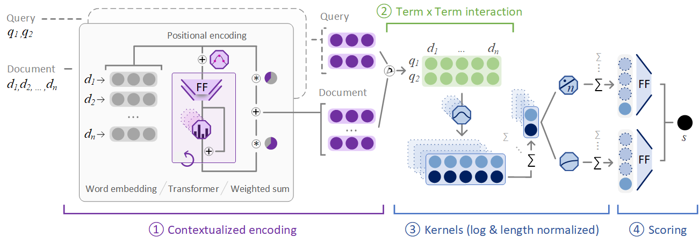

# Welcome to transformer-kernel-ranking 👋

*S. Hofstätter, M. Zlabinger, and A. Hanbury 2019. Interpretable \& Time-Budget-Constrained Contextualization for Re-Ranking. In Proc. of ECAI*

https://arxiv.org/abs/2002.01854

We present the TK (Transformer-Kernel) model – inspired by the success of the Transformer-based BERT model and the simplicity of KNRM (Kernel-based Neural Ranking Model). TK employs a small number of low-dimensional Transformer layers to contextualize query and document word embeddings. TK scores the interactions of the contextualized representations with simple, yet effective soft-histograms based on the kernel-pooling technique. Additionally, we enhance kernel-pooling with document length normalization. 



The main differences of TK in comparison to BERT are:
- TK’s contextualization uses fewer and lower dimensional Transformer layers with less attention heads. This makes the query-time inference of TK with 2 layers 40 times faster than BERT-Base with 12 layers.
- TK contextualizes query and document sequences independently; each contextualized term is represented by a single vector (available for analysis). BERT operates on a concatenated sequence of the query and the document, entangling the representations in each layer.
- The network structure of TK makes it possible to analyze the model for interpretability and further studies. TK has an information bottleneck built in, through which all term information is distilled: the query and document term interactions happen in a single match matrix, containing exactly one cosine similarity value for each term pair. BERT on the other hand has a continuous stream of interactions in each layer and each attention head, making a focused analysis unfeasible.

The differences of TK to previous kernel-pooling methods are:
- KNRM uses only word embeddings, therefore a match does not have context or positional information.
- CONV-KNRM uses a local-contextualization with limited positional information in the form of n-gram learning with CNNs. It cross-matches all n-grams in n 2 match matrices, reducing the analyzability.

**Explore the model results in detail [with our interactive explorer](https://neural-ir-explorer.ec.tuwien.ac.at/)!** 

If you want to jump straight to the model code: [it's here](matchmaker/models/tk.py)!

Please cite as: 
````
@inproceedings{Hofstaetter2020_ecai,
 author = {Hofst{\"a}tter, Sebastian and Zlabinger, Markus and Hanbury, Allan},
 title = {{Interpretable \& Time-Budget-Constrained Contextualization for Re-Ranking}},
 booktitle = {Proc. of ECAI},
 year = {2020},
}
````

## The matchmaker library

* train.py is the main trainer -> it uses a multiprocess batch generation pipeline
* the multiprocess pipeline requires us to do some preprocessing: split the files with preprocessing/generate_file_split.sh (so that each loader process gets its own file and does not need to coordinate)

## How to train the models

1. Get the msmarco dataset & clone this repository to a pc with 1 cuda device
2. Prepare the dataset for multiprocessing:
    * Generate the validation sets (BM25 results from Anserini) via matchmaker/preprocessing/generate_validation_input_from_candidate_set.py
    * Use ``./generate_file_split.sh`` 1x for training.tsv and 1x for the validation set 
    * You have to decide now on the number of data preparation processes you want to use for training and validation (4-6 should do) each file gets one loading process
    * The number of processes for preprocessing depends on your local hardware, the preprocesses need to be faster at generating the batches then the gpu at computing the results for them
3. Create a new config .yaml in configs/ with all your local paths for train and validation/test files
    * The train and validation paths should be the output folder of 2 with a star at the end (the paths will be globed to get all files)`
4. Create a new conda env and install the requirements for python 3.7 via conda: pytorch, allennlp, blingfire
5. Run ``train.py`` with ``python train.py --run-name experiment1 --config-file configs/your_file.yaml``
